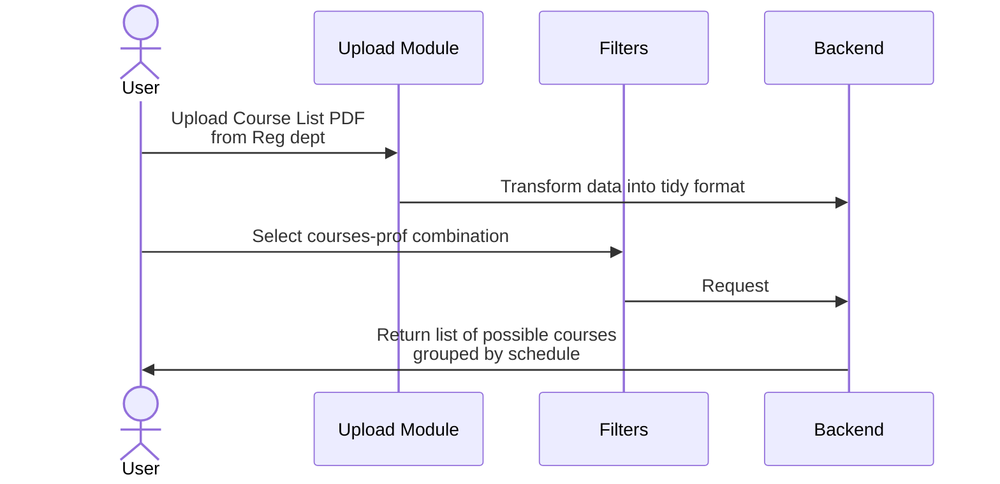

# BITS Registration Assistant

## Requirement

Sample of a list of possible courses grouped by schedule:

- M3 W1 F4 - ML, FDS, NLP
- M2 W7 F1 - AI
- M8 T1 W1 - Blockchain, Robotics

  ...

## Suggest Toolset for Prototype

|                      |                                                              |
| -------------------- | ------------------------------------------------------------ |
| Programming Language | Python                                                       |
| Dashboard            | Streamlit                                                    |
| Data Processing      | (in order of preference) 1. Polars 2. Pandas 3. DuckDB |
| Visualization        | Plotly                                                       |

